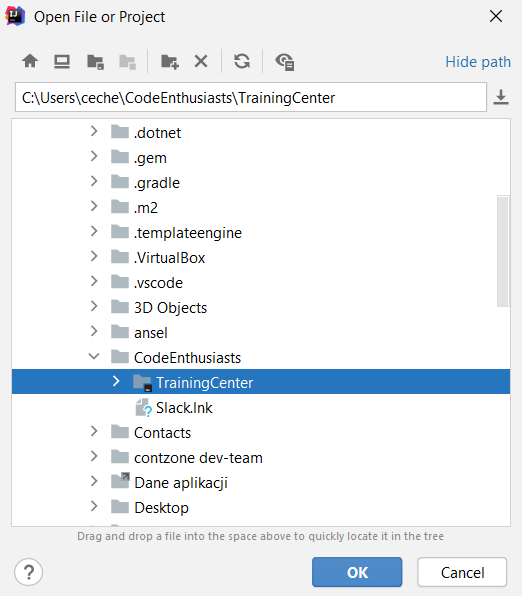
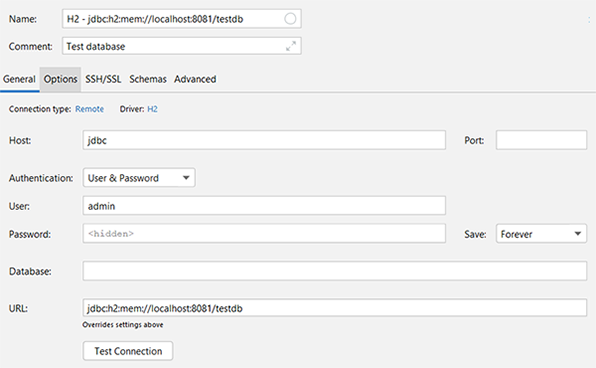
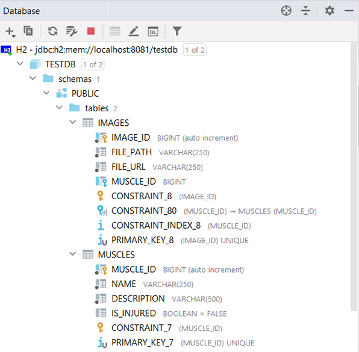

# Training Center 

Web app that allow to create own personal training diary. Do you train and want to monitor your progress by adding exercises, 
sets reps and weights to achieve better results? This app is perfect for you, and also suitable for people who are interested 
in endurance-type sports. 

**If you just want to know how to contribute, visit : [Guide](https://github.com/CodeEnthusiasts/TrainingCenter/wiki/How-to-contribute%3F)**

## Table of contents
* General info
* Changelog
* Deployment Guide
    * Requirements for developers
    * Running application on local machine
    * Connecting with database
    * Test API with swagger
* Data model
    * UML graph
    * Database structure graph
* Planned features
* Technologies
    * Backend
    * Frontend
* Troubles
    * FAQ
* Contributors
* License

## General info
Track and analyze results of trainig is key to progress, so the assumpion of this application is to create personal training 
history with features that allow to reflect on your training plan - get to know your body better, draw conclusions and adapt the plan 
to you -> all to achieve better and faster results. <br> Appliaction allow to add muscles, images and manage you whole training plan. 
You don't have to worry about total tonnage, increase in intensity or muscle overload - algorithm created with guidance of 
experienced trainers will do it for you. It is also helpful for novice and people who love competing, because app allows 
to list exercises with correct technique, and also compete with other members in exercises records and other achievements.

## Changelog

## Deployment Guide
#### Requirements for developers
1. **Java JDK** (< 11) download from [Oracle](https://www.oracle.com/pl/java/technologies/javase-downloads.html)
2. **IntelliJ IDEA** download from [JetBrains](https://www.jetbrains.com/idea/download/#section=windows)
3. **GIT** download from [git-scm.com](https://git-scm.com/downloads) 
 
#### Running application on local machine
1. Run Git Bash and go to the desired location.
2. Clone repository:
```cmd
git clone https://github.com/CodeEnthusiasts/TrainingCenter.git
```
3.Open workspace in your IDE.



#### Connecting with database
1. Open Database Tool Windows - [more info](https://www.jetbrains.com/help/idea/database-tool-window.html)
2. Click icon **+** and choose **Datasource -> H2**
3. Config your connection based on the file **application.properties**
    * port: 8081
    * url: jdbc:h2:mem:testdb
    * driverClassName: driverClassName=org.h2.Driver
    * username: admin
    * password: admin
4. Download an additional driver via IDE.

 



### Test API with swagger

Test API using browser [trainingcenterapp.herokuapp.com](https://trainingcenterapp.herokuapp.com/swagger-ui.html)

## Data model
* UML graph:
[Slack](https://viewer.diagrams.net/?highlight=0000ff&edit=_blank&layers=1&nav=1&title=uml#R7V1bc6M40%2F41qZq9sIvz4TI%2BzCS1OW2cvDtzSYxs8wVbXsDJeH79J3EUksCYgHFmyFRNghCykR493Wp1ty7k8frnN8%2Farm6hDdwLSbB%2FXsiTCwn96CL6hUv2SYmsRCVLz7GjMjErmDm%2FQFwoxKU7xwZ%2BrmIAoRs423zhHG42YB7kyizPg%2B%2F5agvo5j91ay0BUzCbWy5b%2Bq9jB6u4VNTM7MYVcJar%2BKMNSYtuvFjz16UHd5v48y4keRH%2BRLfXVtJW%2FKL%2ByrLhO1EkTy%2FksQdhEP21%2FjkGLu7cpNui574W3E2%2Ftwc2QZUHngePv8y3p8XSXmrgYX8Fje3LwNCjZt4sdweS9wi%2FbbBPeghs7Evc0ejKdqw13NhPK2dzIY%2FQja8O%2Bgx5IkZX8ehKCrpcBevsTuDtv5MXP9CFMFSTywmGk5Be7ZOrn07wnfibeApdZQ%2Fhi%2BQZtlfijvLhzpvHb%2FS%2B%2FxEo039e%2Fx49LQcuCK6u3%2BBAjcFneUsQlHSZEvcQsHPAijv9G4BrgF4CVXgn4KTFIPCAawXOWx57VgzhZfps2twDdNB7SEI83xTViB6JZ9tAkfV8G9Frxo%2BRaKBaUnUh35KcfMWkpagjmJYQFKw9UW2LK%2FhkDfQH0Q9ZUYjHY7BpngKbMcYGwlAQ8zjT9FKk4YsH4DnoNYFH4rcG0iuhlttJelXYJkTdCWxNCmyKQIGtKmw1Graq3CFsuTzCMup0%2FQJsG9gsetFY3FgvSKTmMGm5zhJheDJHaMDQGr0BL3CQyLqMb6wd28ZtjDzgO7%2Bsl7A9jKP4rVDj6uhCnaTIwg2Anzx5Gj%2BciSkShCXTksVN3DyaSIimtNwoiR9DUVIFLhY%2BCD44ZqWTgxi0ARbx0N7%2FG8r%2B542Dv8mFfIn%2BH1HF6GVlEXc%2FfuY90hWSuuEb5Cqs2AavihpbHWoMKzfFd3005sndGf47d3cLPB9uLPcRzKFn%2B2nNB7qcQi1CEsLHyA88%2BArG0IVeWC7b2ouGBl4eLRDxEuVIJZLmcwLXLlgEHFQHcIub3VpzZ7O8CetMlKzkMdbBcBFEzy7ckPZXaC4AzPgeDKygcC6MELzHmIjRrJDG6FrMrsOJsoVeMIYb9FaWE%2BIfWH7wDvygjJ6ZeVU4LWSZJq6EEwm%2BTZXiFaFwijTDkTMlNxGORb0pnVDAHqPEZWJ0KAhaXpTqeipbi9RGfEVL5voSVhU%2Bg2JIS1i5toQVGFmtVpKwTXGxKZ8ClSTCFEpZ07U6CEuBjlo0CLBjzVI5gHeOKlkI2IM4VDvU9ExJHJqSkP6IeSwh6TOUFTP90Yx6IDWNQ3BvGaSicIqFc33SMrXuMCDKEi3r6pKRqNADzTTV9kAn43rGQvJUa01RqioKk1VpF%2FAzmCWiJtVDn6GxLQ1bE4bf%2Fk%2BZ3nyfOqPZ6tYSN4PX3dvbQGPAV7yY%2FO1AyO2RqvaOThlQo9UxTZSGpqnUZEFNKVo8dGH14A6LyK6gzwOh9ZFmdKhG0atFXVXrYcdgBGhFO29jwPgj5Se%2FKz6D%2BDRprtGVutBTTwe90pU7Ab0nbN1xNssH19owMPTfnTUqx4bVBdwEs%2FhOJZNsZLyarxzXvrH2cIeH1w%2Bs%2BWtyNVpBz%2FmFmrUS0KLbXpAAWsvVmOEnY7yFNl7wkOBNpIpurZ%2B5ijcWNlmFBXPoutbWd17S11ijDnc2IxgEcB1XKjLWFZv3CidAdWsYI9DSDQHSGpZUylnDVKEY0R%2ByhqkcGzB6ILGK3sDNkjSgBjGSZsD3HbjJzKc3jo%2FtsC4e86d8JVS8jOyJWTshCiZWAIhPQriKSrJqiPsOV9p6DoJQ4AD%2Bt3mIbu95X8MG%2FtxztkH4LROTceA5%2BZe2ncXCme9c3EZcaUIU9YZiZmqUE9PhCZO4VWgVp4ektDQ9dIWZHoc2Cno%2B7YxP04KDgGltdyFRYiryKeofsFkGK3o3iiSwWa4Oj8YQTe48azMHSTNMG9N8DV4j852PxrOwhTFxO3u8575q3JfySPPcJzTAfVzFnbX10kjsma8j5jNpW7MhcZivtX3VMsNBReLbWOtMrUtwNf0JvLnj57S7d9ZxgO%2BFELsg8JwCPLAFgYO1vPChsMpjvoxbm2isJzoGtaWk8SGe4wK3NZ5jHe4YadkT3bkQnaZ1TnQia2CpzHQpshKqGy5BcIdqfPkrv%2BJEY45q5WgvX8hWTitS7Bc4a5DxXnpF1cg%2F3dNdNbozKwO6C7rj72eKLOHllfue7c6F7dIdkUNw0bW20CIdx3bVLGpxYz3dHLmMzOZu44TThIWZS5EncWz7FDth8Ysf3sSPB7mTTXxdF4eCmPmySXlGEmUVe%2Fpl9xvb3U9ReTYxDezWyKeNaSiemWUhDUiHVnODdE4hDXzdnB0yWuOegMBy3N5u352aI2q0ewbPbi%2FwtGKjLSklcaRUpq%2BsABqs1SPeeOQHnaj%2Fg9Lt5fd%2BEVVnEVUdQCU6DRcualuLKJPd5mGNmD3BdEUwCrMzmHjqHVx3N8Ewpa6ZFRdSlM06qUYXc83WJAtF6kMdg%2FoFN6yPac%2BncJ%2FIV%2FxEWutiLF1cMnb%2BIlHcM%2BUh2mne3tQEVXqrR8f%2F3%2BWlI47vXu7egfr0NhuwHhR%2Fg%2F0TmK82zn87MHXBGnCEZU%2BWJyNLM3km3Uw0WHVMNNsiSy5ojvOiQCugIOwA0trUcwqDjdL5%2BRFK4aOjNUphJSkz3M2myNDydiU1iXRsILCRtBqVTYWOIjry6%2F%2BBLtbMvCIyAUp6lzksuOsQVlJVVVh6adWd7cCozEetGQ9YaZXzT7aIvdmH8CLTi%2FMKvH%2B9eQQ%2B8N4KN3NfWd0p8RoMVWyiLum9l6pcS%2BIpxgewF5pVTRafUGiKJ5GaH0x6hqWtkOzbRI8qonlCaZvYCc46s5RGxxjpUs1oJU2kWlIFZZjsPzUfsMTv8tNm44sznmXY1BS5IjqP3l5sEJfyZ8AlHTqui3VxSXtCKObJcamcJBMfmZLFoICpfgJgKsZnACZNmKZecx2jJZG9JDANg8n9ciKMcoI9s3i3M1qkCH%2FUIoXx4xI5FjVuNIfRlvZ3ZJwn7Z5PR0Qm62Cht7nVsbnVCIWsCCCtNQCdOkGZmK4ZYqlmHJSGZQnKOCuLuMVT2fE%2BRSYzuTyTmZTPZEYpZJVzJJjC0FSzVqj0zpJmDGWV%2BBIUpttOoMDaAZmI9jMSrX%2BW%2FY8RrTIvoyg3ULK1nX31uN2qRFjGtyNRSwTzxrZmfjDwhfwVCVXEoPg2ES%2FHpjaw9veLfwF4TZuZWHs%2FKSLrHcqvEKLtCYeIpAEk5O0Fmhn%2Bqvh%2BQfaEXVzE5paY7Dwr58YQh6d8iT4pTPGLv1IuYmYDA9DrI7VTM7QXntyeCxYbcMr4evZEfUY%2BWGmIwUk2ako966sGs%2FDC8CbHhOEx3lJZ%2BF1c6%2BlQPF5Kh0xbxa7NAs%2F7ClT1hO5p8hDlfKJtH5Ylr9dh%2FvyeGRkg2xYwFlxm1OYGeFk0w4w0L4oib3HP82duzd3qOFpEvYb6H33TYgMRrvLsuXUVsrS7iwboN2Ka0lnbuEt8a%2BqYKLAGound820ke%2BhsGz35nAv5CFXJR29LKUtD3UmDy%2FXtlOCT2%2Fun6%2Fu7nj4qxwmnk7FxAlFac%2BrkZP1O%2BSOvdPfscSbsYVYlDzpzd3OoYZ1HbqdP00eCPP6%2Bvrmny3oqqaqJpNOycSZpbatK4mR0wkxCLrZ7CjkTCjF4OZC5wZz0GSiN4UVm98Zn0%2FH93WRGqiDXd89PU7Lk6v75cdYTSVUiSWdl40Sit0YkrHdNppKQQZM9m3TEJhIdDcA1pvBNbq3xicTyCdZBvj1e3pL88XD%2FnKeY0eVj7vJ%2B8uPf6fW3q6eeZCqTTBM5xrlwaY1kVM7RuSnJXJSmmu95pjueETh6y4l5RuXsgF7OfpBKy3RyjRXfTGe5fJwQl9d3s8u7aU8vlf32mkhve1p60Vkd5vn2Blv1p9%2Bmd5OeU3g75MYc8HfIXwxVUUv9AD9gilU5uW3TQAgSLLLSFqVwjgR%2FWjl4R3npWVu844Nj7dH8wUVw4%2BLXQT0Qnr4yJIhl7Fo%2BrrJCX9rFXxznTBMc7NPzgltGD8%2FnOw%2F9XkMPXwYrfDQRahJvoI8xJCEuxf95wN6F2%2BrZV1hvXeycuY%2BqEp%2Fr4CcBGhYr%2BsRgBdbo18KD6%2BgqbA%2B7UwlfooLw063w%2F52%2Fs9z4lXZr%2F6%2BcvYj3Z9w1Vujzil4FWGG%2FWMulB5aJDxP04q8M%2FTg7C7Uvj9%2Fg9%2FpjUPjDCzql41YPdzAeNdsJDcLDso%2Fjhrjy%2Frxe4HkId7htKwy%2BtTYYB%2F5uuURoiU46Gof4TGFkw%2FeN79iAgFH0ZTEvAFzvy9x15q9hYxiL%2BCsnKCaxdWu9gvi5Odzu0%2Fo%2BCH%2BFc2DnJx8%2Bc62wTQzfr44bz5bpTyzdIkaQhOfHm78qC%2FWU0opI8NMK9VB%2BRaJFlKsL%2BVRifkTI83mb9mRujrclhrcZALR3MHMnB94yMTaKREnFyjFdjHLPNNVyGJfO2TtPvHyLR%2FHFhVhBIkYsSlSSDqfwqcZPpneY648f01Tb48fuYH99fnp%2BnGKSnl7iv1hLca9pIyGj4n%2FctWb4E%2FcNUR79NKOBD%2Biw0PQMdwLwMs%2BtWW7idAk%2BlNhggokDglQrWECIfyEGD99kDe0d6m9ah3r2AVY7tx5EqmioiWO93YOZR9bDCgYw1mpG0MZtZVF9X7ZJ2FORFhw%2F4u%2FXSZ9aG8vd%2F0IfW6LPPQIrfCxx9cdf0Y10upcdwjLW2XnPzfZ%2BECryECtqFsI9eMvlPombRL9V%2FCJRwiA8jmG0A37H7c7HawdREF7xx4Jgzv%2Boq72dhh%2Bkfcar%2BABsGEWGlbzwzAVgO4CDqCJfx833RdSTe%2FdXOICECksOZvimSIKHPng%2B4oV8Tpmq5px0ihVMyt9G86vOIeX0%2FhGNkM8jTRzzwf%2FOrHGweY3w7PLu87sittqRkZdleZw6SbVmSnouJlLLSyZdNYaCZtRTkETmPHS9ooLbSvI1%2FiCx7l9Rrqxea%2BouMSiFGk1n1aMTJwbV2d0yXJ%2Fjpl6ewgDJIoCLHqzCg7NW0LVxOCJ834S1OFWQ6PErNbLbbvNNVBTRf1LITTktnGfIzbNked%2BnI%2Bf5yvpP%2F%2B%2BrfD%2F7h3tAXIuid5hLalBN9ApDScklGxKT5AjHpleoJJW5vcRLaMXtTaNDqcyYFmS1bgJU5sAbtcsDb%2FhdzZoxyoCb2J9sy18BO0MsYX0iTFNSEX4VXcmpj6YhlqO4bloO7jtLFWEod4lCGjoyfVpXdU1QONRUg9k1uBjjJUttH2OaQWAszAXTUlZJbjyG9hlQZipIClCpWGRJGZo6kd6sdvpnBsK0W0zLuOP4cpbhbgPDJQYJJjQmyWoD6TUruIQby51mpR8UyS2shvkTkLMaLj2w5CAYPwo8mU4NXp%2FeVLljeuP4fsaDxICNODKOPv2Nc4RcgYL%2FEi8TeZFhZdOg6NC4I4znxx4G9yGdOpmtRL%2BG6%2FiPdqsXLQjOqF9P262nPEohbyXUxAN2wkYlcEJmh7OvdWkE%2FJ2YkLelHeYdCedGb9brzKwn0mvaqhETTex5lqrHZBAnfOsPhuoYKAK1Pc7JtMe3rNGGjeaAwpLKB7LYrnf%2B3AX%2B9eYNum%2BAaIbIt3cb1uEl2HNwGh1%2Bkr7r%2BFbyUG%2FsZZWoUh5o3NjbRF5l%2FmqKAeR456OJ2%2FNX9%2FxFB%2B1U5a9G0s%2BV2BqbYa9d5OIT3Y78fXqeqbZYqw6lI2mmvcN7WOsV9sDqY5DPgGfY03iMqluQrYUGiqxcqhSC3HNI1Y1psbph51xCAUVW%2Flz1BHKGBGJ2H1sssistOofS9d34queLynzR2tqmNb5QWF%2BrGfrqPVGcDVFwszeemCkU1tH49vKGzN74dRoV9FRRjSqUs84yULqpTIDAesEzdY73JPp0%2FJ1Thygx%2B0G6WZE6aF%2Fx5lDDUkd6%2FElq2sjtGhGnkgAi%2BKd3qT3G%2BtEavZht0Yt03OFjtZx3Ekec7KAwwhvH1C%2FK%2FXEqOseWDkjbjjbhqVuZK5eg5giBmeZVt5qRbjEkWk2jVNKT6%2FShicgmPeyLciE72uu1zstJsWNbBsKo%2FWZ9f1j32fPy%2FYln0afz%2FWFdRs%2FL96exfj1tt57k3G3i%2BEWROthdPqULbnL0z3k7AClqnkvzLIbWWsIQMV36I9VjbFGkD%2Bpmsvs3xMpiqifQp0A1xcTv%2Bx%2BBMv3n9e%2FR03LgguDq%2Bg1yNtqSffx%2BAVJ%2FAcLwGGcmVvcmSfOfncR0wYVJo94kNvDnnrNNTy4ccWvFXiN8lxFuvqp%2BWVMFfMU0cBZGE%2B7XOy7a6oMnKqPeViRyVSMOhSwG8PhVDSUeDwrlMp4%2BKJMjv6%2BTiOAjT0CuG5IfHoFMxfhLpjRUk4DXEx12rLAbxVxfkl5QnspSNxDpUCktUQPJbCIiT1K2dkaTcVzUXlP55Uohe1DlV6QONXlK2zHQ1K7HFOlIF7bUNkWw2vQgeqZIU7rACSuBd0BhCsfa99%2Bhl7UENnNvv41yt3KfAGvLYY8VZD6aOgk19I9Ly3K1%2FfkKhCm00jbTgly9eejWOS09nHucq9P7%2Fx7r%2F6tUJ8uSPEtcZmzi2DKuCsMS43T9AuwwlRl%2F3DmWqELRuUaDE5qnaXNWfnBw%2F1u7APpxHHQzSzYmQ3UaU0R0t87p7SY2jLidfZJotZr5qerkwqqnSnPnTpK5m9SliwF7Ehmo0LkGVKmmDBTpuDiVDkQ%2Fae4Mbv%2BzHro5oXM%2B%2BrSs%2FFH6tExvfGscnxmJJzTK4t3ij3vE9v7NMlQfClHPSesv8s6xkikZZbkBVqICMIK7JBVwZdSiSw%2FCgKyOE4%2FfQhtvj0z%2FHw%3D%3D)

* Database structure graph:

## Planned features
* Create and login user
* User records system -> add record for given exercise or create your own record (f.e make a somersault)
* User achievements system -> get achievements for behaviour leading to progress (f.e train 3 x per week, beat old record)
* Exercise with description and images -> 2 types of exercises (endurance vs strength) and accordingly data (distance x time, reps x sets x weight)
* Calculate tonnage automatically
* Create training plan
* Add priority to training plan (focus on specified task/exercise/muscle)
* Create training session
* Inform, when tonnage in consecutive months are lower
* Infrom, when one training plan have too much specified muscle part dominance (f.e to much biceps workouts in one month/plan)
* Start/End training button (time counter)
* Add some informations about training sessions (f.e difficulty of exercise) after them
* Create up to date training plan - during the training
* Add own exercise
* JWT Token security
 
## Technologies and Tools
#### Backend 
* Java 11
* Spring Boot 2
* Hibernate
* JUnit 5, Mockito 2, AssertJ
* MySQL
* Cloudinary API
* REST
* SonarQube
* Swagger
 
#### Fronted
* React(Hooks)
* Redux
* Styled Components
* Jest
* React-testing-library
* Reac-router
* Axios

## Troubles
#### FAQ
 
## Contributors
1. [Damian Naglak](mailto:damiannaglak1@gmail.com) as [naslakboss](https://github.com/naslakboss) - concept, backend, project management, group formation
2. [Paweł Karpiel](mailto:pawel21599@gmail.com) - backend
3. [Przemysław Saja](mailto:przemyslawsaja@gmail.com) as [przemyslawsaja](https://github.com/przemyslawsaja) - frontend, concept
4. [Igor Chmielewski](mailto:igorchmielewski@gmail.com) - backend
5. [Agnieszka Dzierzkowska](mailto:aga.dzierzkowska21@gmail.com) - ui/ux
6. [Karol Kaczorowski](mailto:KarolKaczorowskiC.dev@gmail.com) as [KarolKaczorowski78](https://github.com/KarolKaczorowski78) - frontend
7. [Kamil Cecherz](mailto:cecherz@outlook.com) as [pangeon](https://github.com/pangeon) - update read.me

## License
